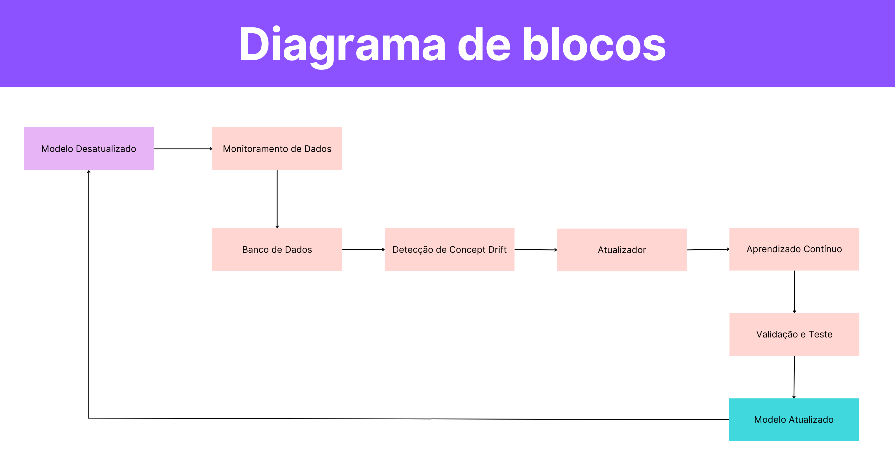

# Proposta de aprendizagem contínua em modelos conversacionais.

## Introdução

A utilização de modelos conversacionais em grande escala vem se tornando uma prática comum em diversas aplicações - como chatbots, assistentes virtuais - e estes modelos são treinados utilizando grandes conjuntos de dados coletados de diversas fontes.
No entanto, é nítido que novas informações, eventos e descobertas surgem o tempo todo, o que pode rapidamente tornar os dados utilizados nesses modelos obsoletos. Essa problemática é agravada pelo fenômeno conhecido como "concept drift", onde a distribuição dos dados ou o próprio conceito subjacente muda com o tempo. Com isso, por mais robusto que o modelo possa ser, com os dados desatualizados ele pode resultar em respostas incorretas. Portanto, é crucial abordar esse desafio e garantir que os modelos de linguagem permaneçam atualizados e relevantes, utilizando de conceitos de MLOps.

 

## Solução Proposta

### Diagrama de blocos

A figura acima apresenta um diagrama de blocos que representa a técnica de Aprendizado Contínuo (CLK), baseado no artigo "TOWARDS CONTINUAL KNOWLEDGE LEARNING OF
LANGUAGE MODELS". Com essa técnica, é possível que as informações sejam capturadas em tempo real, de maneira eficiente e segura, atenuando a problemática mencionada.

### Descrição dos blocos

- Modelo Desatualizado: partimos de um modelo sólido, treinado com diversas informações, porém que não se mantém constantemente atualizado, sendo necessário realizar ajustes.

- Monitoramento de Dados: bloco responsável por monitorar constantemente os fluxos de dados de entrada. Ele coleta e armazena novos dados que representam a evolução do conhecimento de mundo, descartando dados duplicados ou redundantes. 

- Banco de dados: módulo de armazenamento dos novos dados e dos dados anteriores. 

- Detecção de Concept Drift: uma vez que novos dados são coletados, esse módulo analisa os dados para detectar mudanças significativas (concept drift). Se uma mudança for detectada como necessária, o processo de atualização é acionado.

- Atualizador: este módulo é o responsável por realizar as alterações no modelo com base nas necessidades identificadas.

- Aprendizado contínuo: neste bloco, o modelo é treinado adicionando os novos dados, garantindo que ele aprenda o novo conhecimento sem esquecer o conhecimento anterior, configurando o aprendizado contínuo. 

- Validação e Teste: bloco onde o modelo é testado para garantir que possui um bom desempenho com antigos e novos dados.

- Modelo Atualizado: Após a validação e o teste, o modelo atualizado é implantado, substituindo o modelo anterior. No entanto, percebe-se que acaba se tornando um ciclo, já que em algum momento este modelo se tornará desatualizado, passando novamente pelo mesmo processo. 

 

## Conclusão

A atualização contínua de modelos conversacionais é essencial para garantir que os sistemas conversacionais forneçam informações precisas e atualizadas, dado o ritmo acelerado das mudanças no mundo. Portanto, o CLK é uma técnica segura e eficiente que pode ser implementada para manter a confiabilidade dos modelos. Com isso, a solução proposta se demonstrou eficiente ao combinar técnicas de monitoramento de dados, detecção de concept drift e treinamento incremental para manter os modelos atualizados.
O esforço para implementar desse sistema envolve aspectos técnicos e também considerações sobre a frequência de atualizações, a relevância das novas informações e a capacidade de manter a eficácia do modelo.
Portanto, embora a implementação deste sistema exija esforço e recursos, é um investimento necessário para garantir a relevância e precisão dos modelos de linguagem, sendo de extrema importância para as mais diversas aplicações.

 

## Referências Bibliográficas
1. Jang, J., Ye, S., Yang, S., Shin, J., Han, J., Kim, G., Choi, S. J., & Seo, M. (2022). Towards Continual Knowledge Learning of Language Models. Disponível em: https://arxiv.org/abs/2110.03215. Acessado em: 02/10/2023.

